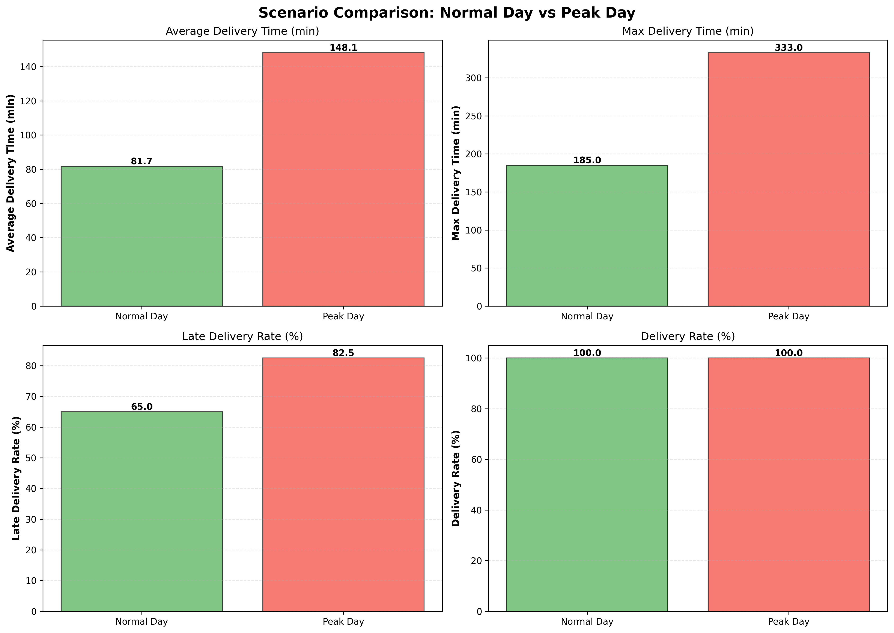
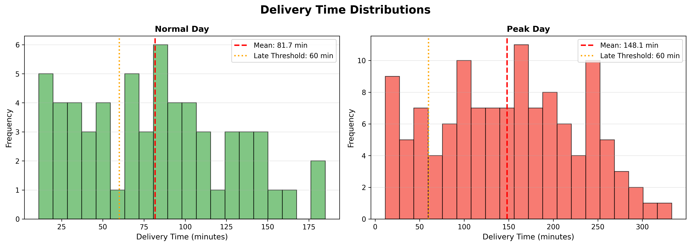
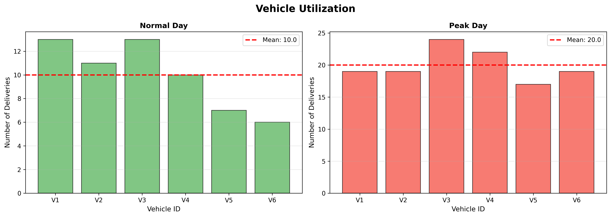

# Hybrid Last-Mile Logistics Simulation

[](https://www.python.org/downloads/)
[](https://simpy.readthedocs.io/)
[](LICENSE)

> A hybrid **Discrete Event Simulation (DES)** + **Agent-Based Model (ABM)** for analyzing urban micro-hub logistics under varying demand conditions.


---

## 🎯 Overview

This simulation models last-mile delivery operations using electric cargo bikes from urban micro-hubs. It combines:

- **Discrete Event Simulation (SimPy)** → Stochastic order arrivals, queueing, time progression
- **Agent-Based Modeling** → Autonomous vehicle agents with individual decision-making

The model compares **normal demand** vs. **peak demand** scenarios to identify capacity bottlenecks and service degradation patterns.

---

## 🚀 Quick Start

### Installation

```bash
# Clone the repository
git clone https://github.com/kevykibbz/hybrid-lastmile-logistics-simulation.git
cd hybrid-lastmile-logistics-simulation

# Install dependencies
pip install -r requirements.txt
```

### Run Simulation

```bash
# Run complete study (both scenarios + visualizations)
python main.py

# Or run individual scenarios
python experiments/run_normal_day.py
python experiments/run_peak_day.py
```

**Runtime:** < 1 minute for both scenarios

---

## 📊 Key Results

| Metric | Normal Day | Peak Day | Change |
|--------|-----------|----------|--------|
| **Orders Generated** | 60 | 120 | +100% |
| **Avg Delivery Time** | 81.7 min | 148.1 min | **+81%** |
| **Late Deliveries** | 65% | 82.5% | **+17.5 pp** |
| **Max Delivery Time** | 185 min | 333 min | +80% |

### Key Findings

✅ **100% delivery completion** maintained under doubled demand  
⚠️ **Service level degradation** – 82.5% of peak deliveries exceeded 60-min target  
📈 **Primary bottleneck** – Fleet capacity (6 vehicles insufficient for peak)  
🔄 **Vehicle imbalance** – 41% workload variance between agents

---

## 📁 Project Structure

```
hybrid_simulation/
├── data/                   # Synthetic data (facilities, fleet, parameters)
├── simulation/             # Core DES+ABM logic (environment, orders, vehicles, routing)
├── experiments/            # Scenario scripts (normal & peak day)
├── outputs/                # Generated results & visualizations
│   ├── metrics.csv         # Comparison table
│   ├── *.json              # Detailed results
│   └── plots/              # 3 publication-ready charts (300 DPI)
├── main.py                 # Main entry point
├── visualisation.py        # Plotting functions
└── requirements.txt        # Dependencies
```

---

## 📈 Visualizations

The simulation generates three publication-ready plots:

### 1. Scenario Comparison


### 2. Delivery Time Distribution


### 3. Vehicle Utilization


---

## 🛠️ Technologies

- **[SimPy](https://simpy.readthedocs.io/)** – Discrete event simulation framework
- **[Matplotlib](https://matplotlib.org/)** – Visualization and plotting
- **[NumPy](https://numpy.org/)** – Numerical operations
- **Python 3.8+** – Core language

---

## 📚 Documentation

- 📖 **[Full Documentation](DOCUMENTATION.md)** – Comprehensive guide (300+ lines)
- 🚀 **[Quick Start Guide](QUICKSTART.md)** – 5-minute setup
- 📊 **[Simulation Insights Report](SIMULATION_INSIGHTS_AND_REPORT.md)** – Complete analysis (800+ lines)
- 📝 **[Project Summary](PROJECT_SUMMARY.md)** – Deliverables checklist

---

## 🎓 Academic Context

This simulation demonstrates:

1. **Hybrid Modeling Approach** – Combining DES efficiency with ABM realism
2. **Urban Logistics Analysis** – Micro-hub capacity planning and bottleneck identification
3. **Stochastic Modeling** – Poisson arrival processes and queueing theory
4. **Agent-Based Behavior** – Autonomous vehicle decision-making and emergent patterns

**Use Cases:**
- Academic research on urban logistics
- Teaching simulation methodologies (DES + ABM)
- Capacity planning for micro-hub networks
- Policy analysis for last-mile delivery

---

## 🔬 Key Parameters

| Parameter | Normal Day | Peak Day |
|-----------|-----------|----------|
| Order Rate (λ) | 2.0/min | 4.0/min |
| Total Orders | 60 | 120 |
| Fleet Size | 6 vehicles | 6 vehicles |
| Vehicle Capacity | 5 orders/trip | 5 orders/trip |
| Simulation Duration | 480 min (8 hrs) | 480 min (8 hrs) |
| Random Seed | 42 | 42 |

All parameters customizable in `data/parameters.py`

---

## 📈 Recommendations from Simulation

Based on results, we recommend:

1. **Increase fleet by 33%** (add 2 vehicles) to meet 60-min service target
2. **Implement route optimization** (VRP algorithms) – Est. 25% efficiency gain
3. **Rebalance vehicle allocation** – Assign more vehicles to high-demand Hub H2
4. **Add third micro-hub** – Reduce average travel distance by 30%

See [SIMULATION_INSIGHTS_AND_REPORT.md](SIMULATION_INSIGHTS_AND_REPORT.md) for detailed analysis.

---

## 🚧 Future Work

- [ ] Integrate real GIS data (OpenStreetMap, OSRM)
- [ ] Implement Vehicle Routing Problem (VRP) optimization
- [ ] Add traffic congestion modeling
- [ ] Model customer behavior (delivery windows, preferences)
- [ ] Multi-city comparative analysis
- [ ] Economic optimization (cost per delivery, pricing)

---

## 📄 License

This project is licensed under the MIT License - see the [LICENSE](LICENSE) file for details.

---

## 👤 Author

**Kevin Kibochi**  
GitHub: [@kevykibbz](https://github.com/kevykibbz)  
Repository: [hybrid-lastmile-logistics-simulation](https://github.com/kevykibbz/hybrid-lastmile-logistics-simulation)

---

## 🙏 Acknowledgments

- **SimPy Community** – For the excellent discrete event simulation framework
- **Urban Logistics Research** – Inspired by modern micro-hub delivery systems
- **Queueing Theory** – Foundation for stochastic modeling approach

---

## 📞 Contact & Support

For questions or collaboration:
- Open an [Issue](https://github.com/kevykibbz/hybrid-lastmile-logistics-simulation/issues)
- Review [Documentation](DOCUMENTATION.md)
- Check [Simulation Insights](SIMULATION_INSIGHTS_AND_REPORT.md)

---

## ⭐ Citation

If you use this simulation in academic work, please cite:

```bibtex
@software{kibochi2026hybrid,
  author = {Kibochi, Kevin},
  title = {Hybrid Last-Mile Logistics Simulation: DES + ABM},
  year = {2026},
  url = {https://github.com/kevykibbz/hybrid-lastmile-logistics-simulation}
}
```

---

**Built with ❤️ for urban logistics research and education**

*Last Updated: February 7, 2026*
